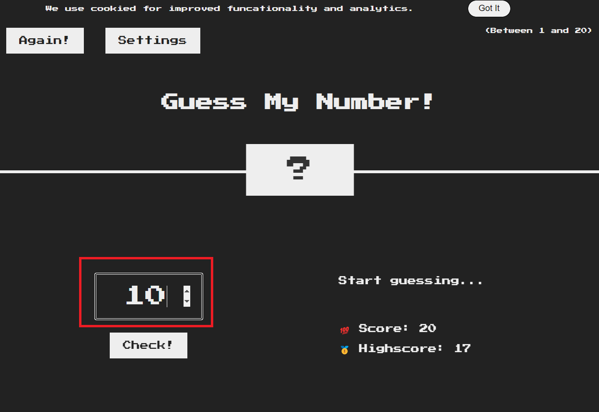
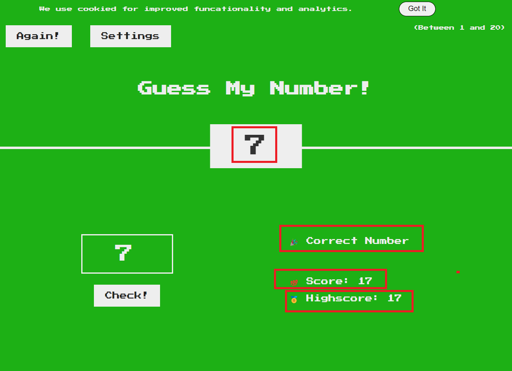
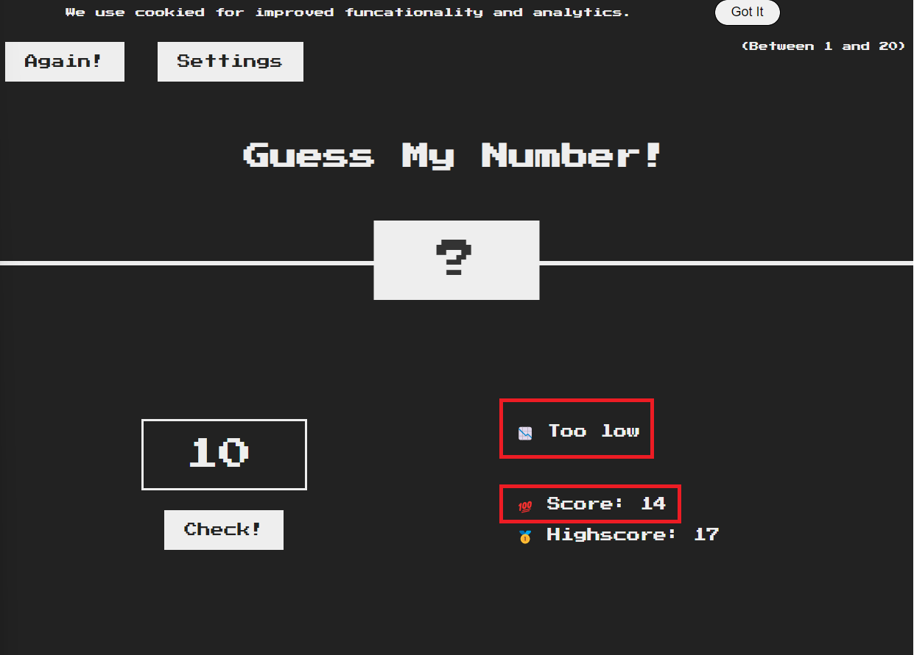
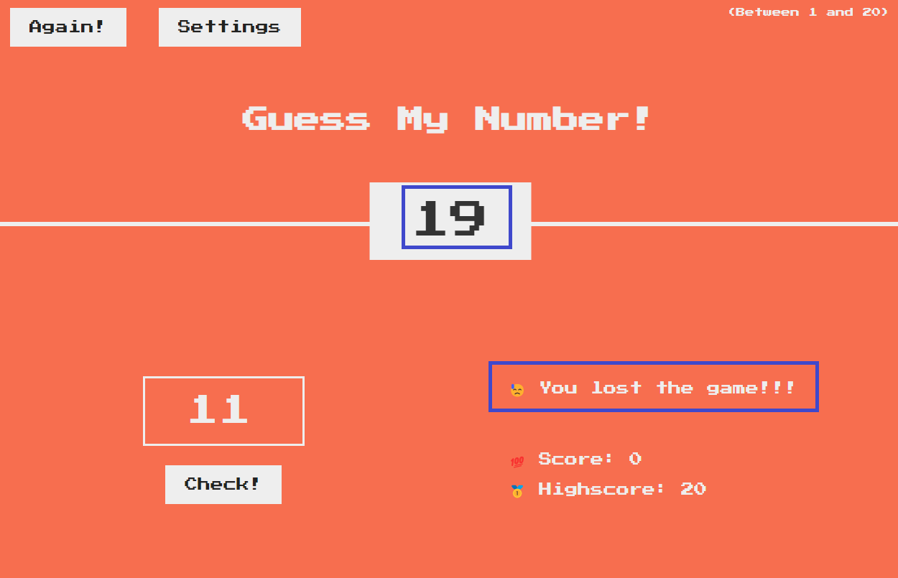
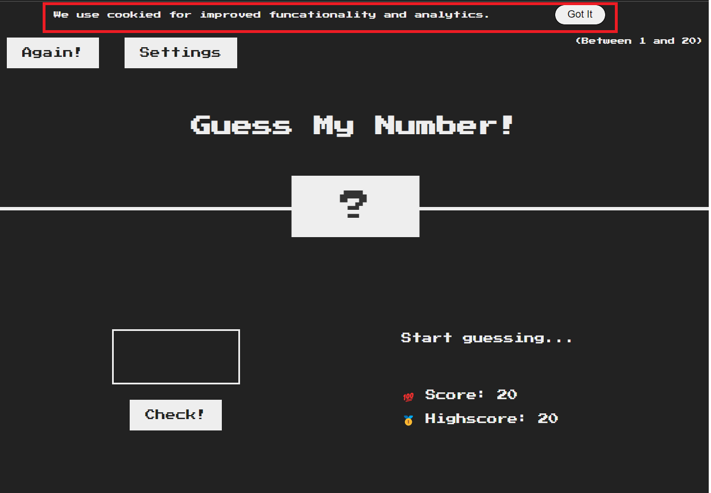
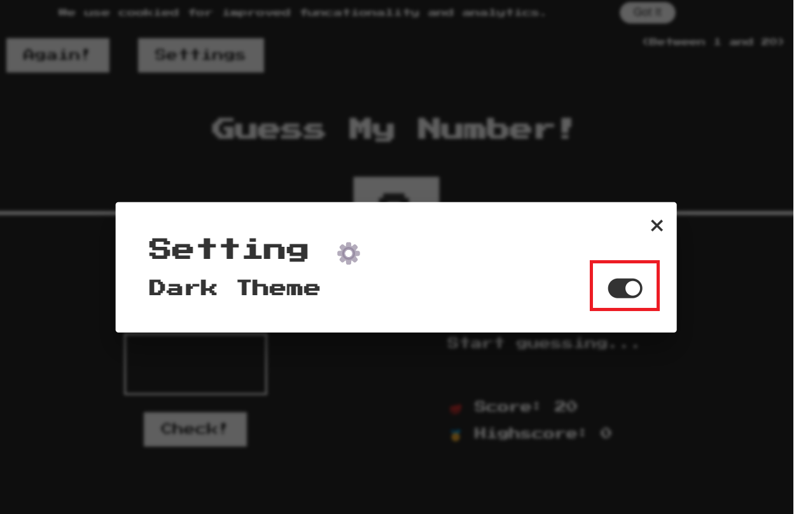
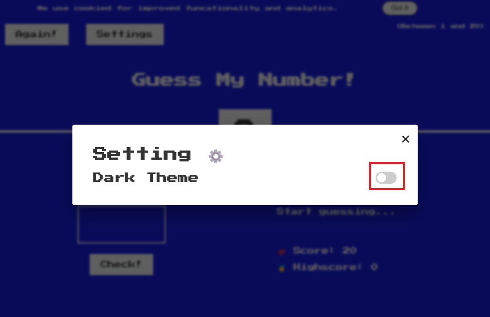

# Guest my number game

## Rules:

1. First of all, we'll random a number between 1 and 20 I call it ***target number***, and player have to guess that number.
2. Let player input a number into the guess input field

    

3. When player press 'Check' button or hit 'Enter' key, the game will check whether the inputed value is equal to ***target number***. 
    - If correct, we'll change the message on right side of screen to something like "Congratulation 🎉🎉🎉", change the "?" to the ***target number***. And set the current score and high score (the inital high score is 20). Also change the background to green color.
    

    - If incorrect, check if current score is greater than 0, decrease the score by 1. Also update the message: If the ***target number*** higher the the guessed number, the message should be "Too low", otherwise "Too high".
    

    - If incorrect and the current score is 0, expose the ***target number***, change the message to something like "You lost the game 😢😢😢", also change the background color.
    

4. Press button "Again" to restart game, but remember that don't reset the highscore.

## Improve
1. Use JavaScript to add an "cookie" element, shown as image below. And if user click the "Got It" button, the "cookie" element would be removed:

2. Use JavaScript to add a setting button, when user click the Slider to turn off or turn on Dark Theme, change the background color:
    
    
